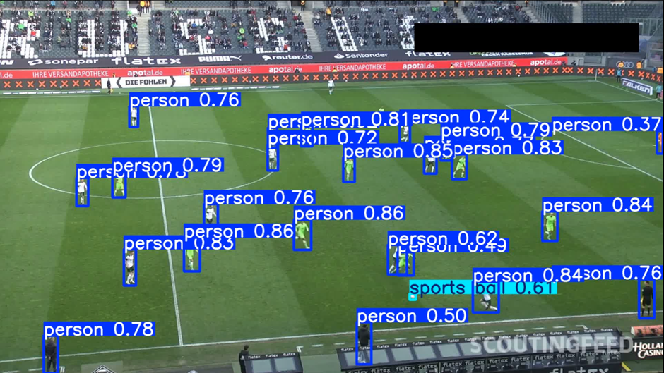
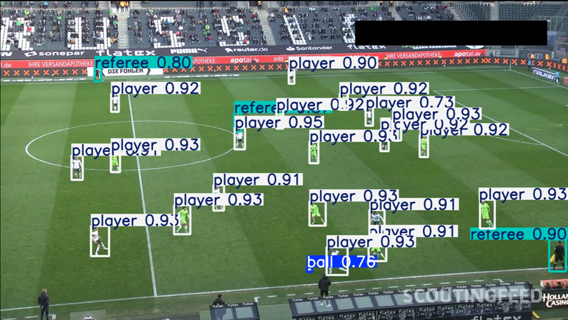
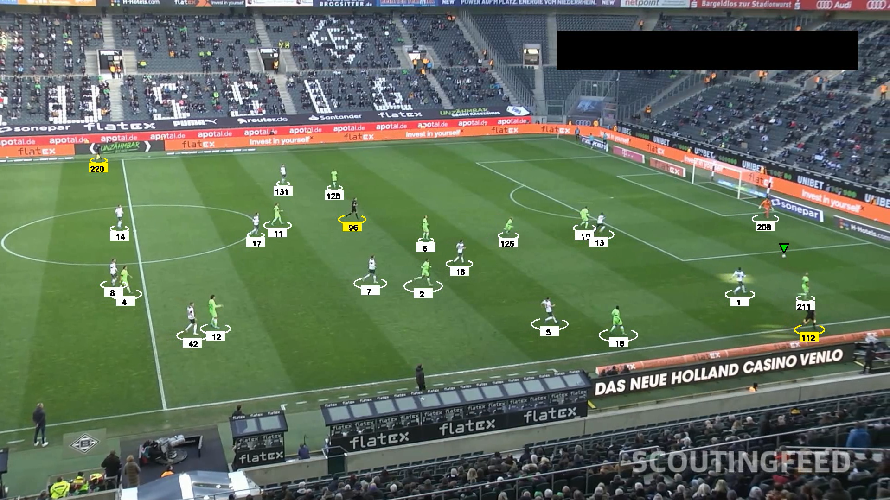
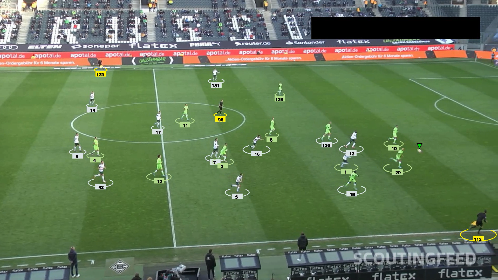
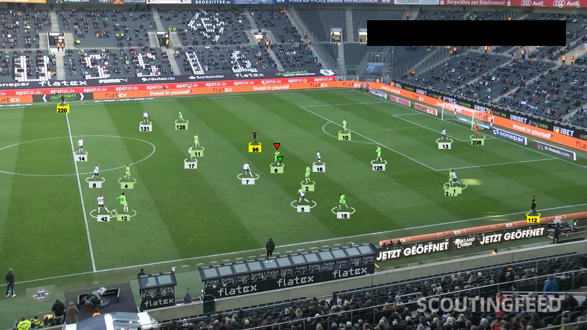
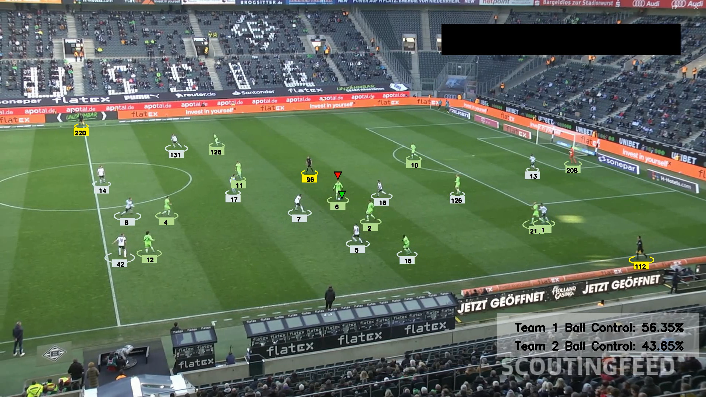
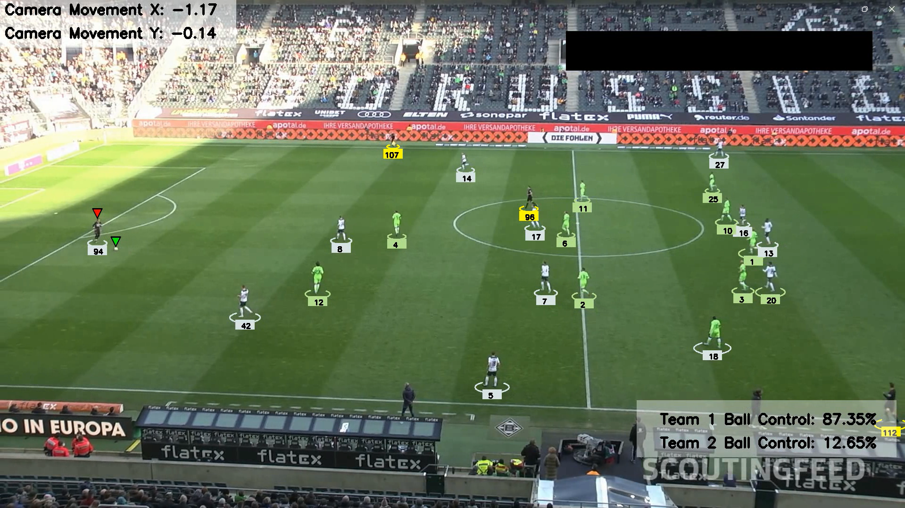

# KickVision

This repository features a comprehensive computer vision and machine learning project dedicated to football analysis. It employs various cutting-edge techniques to provide detailed insights into player movements and actions.

Check out [this](https://github.com/ehz0ah/KickVision/tree/master/output_videos) video!🎥

## Features

1. **Object Detection with YOLOv8**

   - Utilizes ultralytics and YOLOv8 to detect objects in images and videos.
   - Fine-tune and train YOLO on a custom dataset for tailored detection.

2. **Pixel Segmentation with KMeans**

   - Clusters pixels to segment players from the background.
   - Accurate t-shirt color detection using advanced K-means clustering.

3. **Motion Tracking with Optical Flow**

   - Measures camera movement through optical flow analysis.
   - Tracks player motion seamlessly across frames.

4. **Perspective Transformation with OpenCV**

   - Uses CV2's perspective transformation to represent depth and perspective of the scene.
   - Enhances visual analysis by adjusting for perspective changes.

5. **Player Movement Analysis**
   - Measures player speed and distance covered in the image.
   - Provides quantitative data on player performance and movement.

## Datasets

- 30s football clips: https://www.kaggle.com/competitions/dfl-bundesliga-data-shootout/data?select=clips
- Fine tuning and training of YOLO: https://universe.roboflow.com/roboflow-jvuqo/football-players-detection-3zvbc/dataset/1

## Iteration 1

- Utilised YOLOv8 for object detection

## Iteration 2

- Fine tuned YOLOv8 to accurately detect players, referees and ball while filtering out noise factors

## Iteration 3

- Updated players, referees and ball bounding box for easier tracking

## Iteration 4

- Performed KMeans Clustering to separate players into their separate teams

## Iteration 5

- Implemented interpolation and back filling using Pandas to address occasional missing data for the ball tracker
- Integrated a tracking mechanism (Red Triangle) to identify the player in possession of the ball

## Iteration 6

- Added ball control statistics for respective teams (White = Team 1, Green = Team 2)

## Iteration 7

- Estimated camera movement using Optical Flow
- Adjusted players' positions in relation to camera movement

Work in progress...
